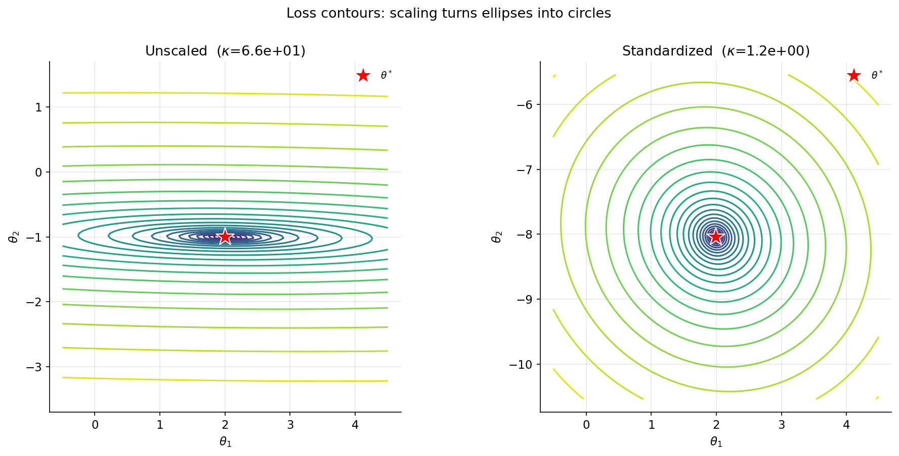
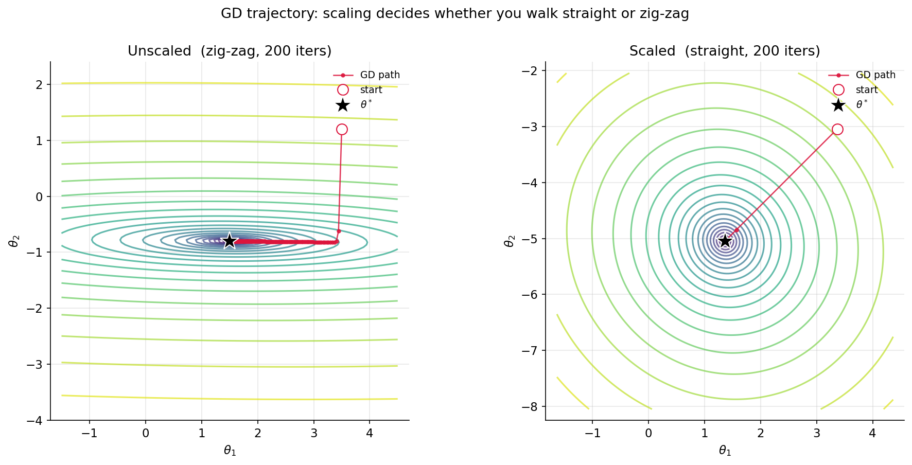
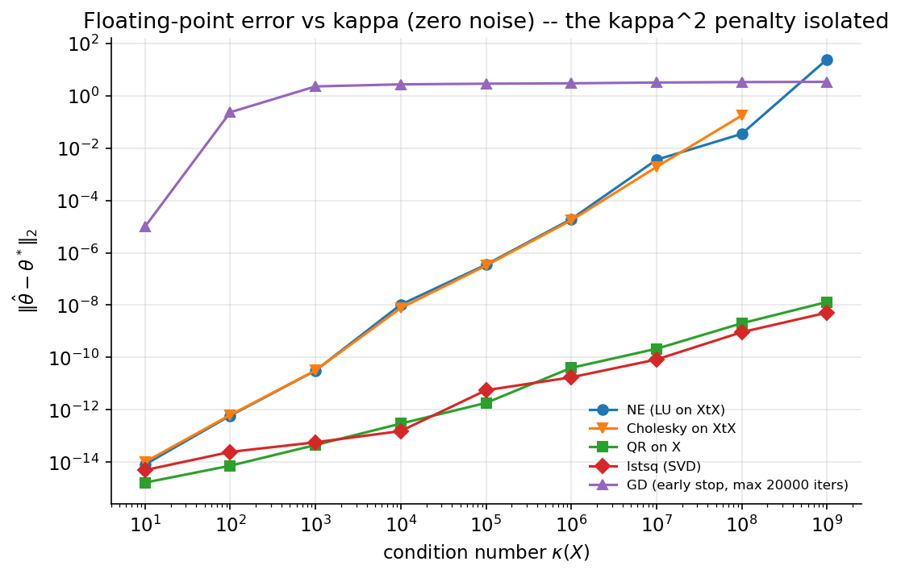
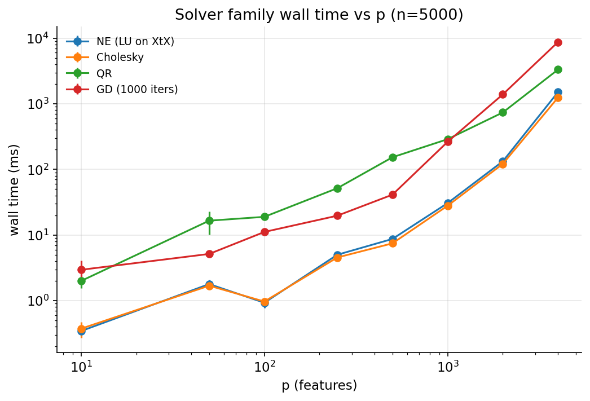
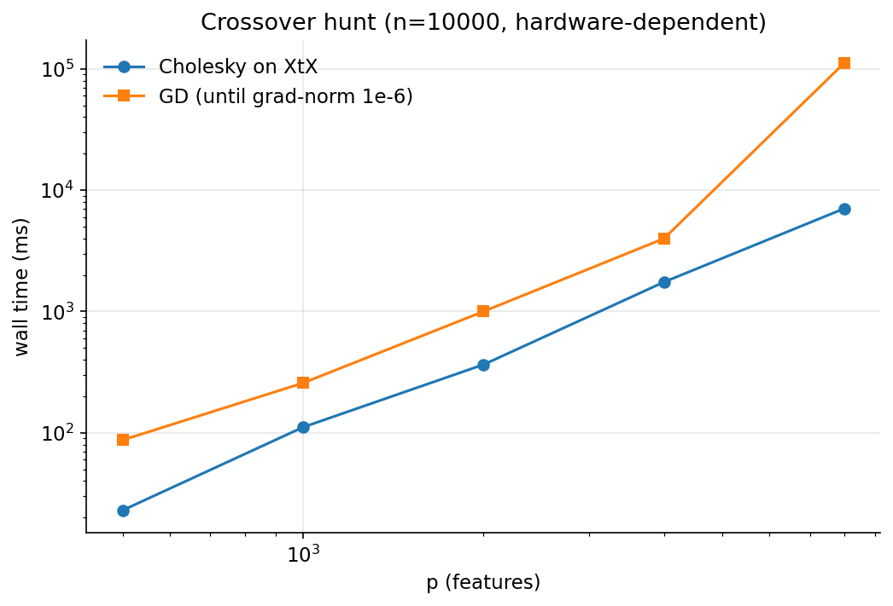
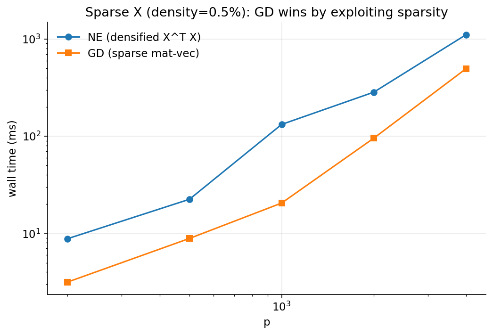
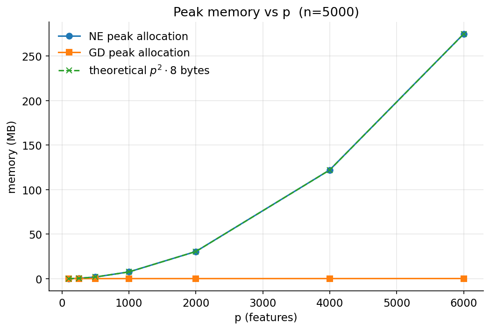
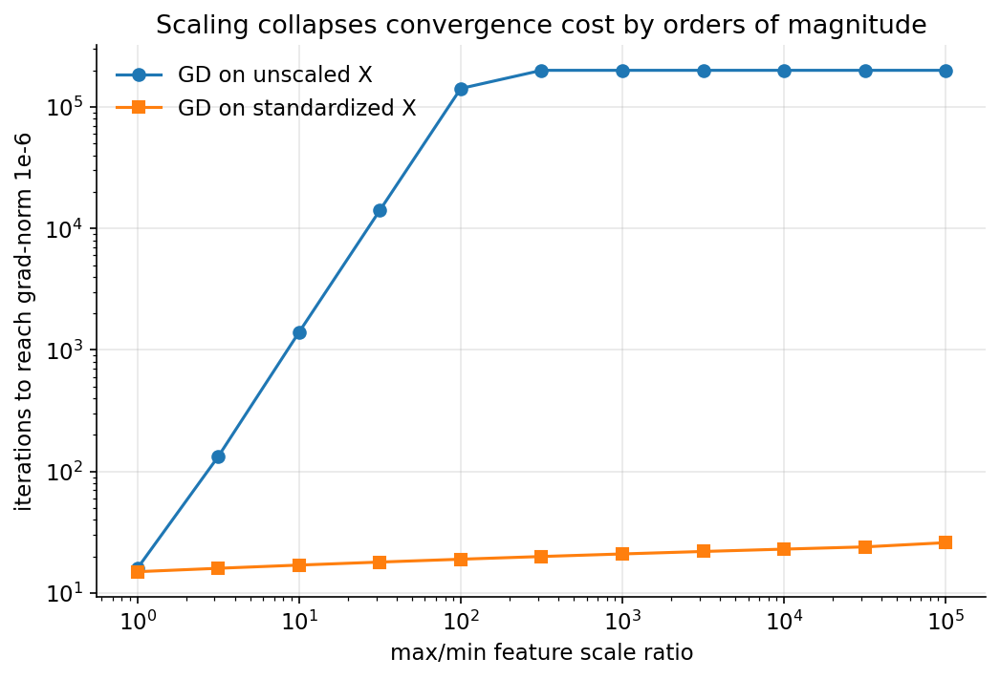
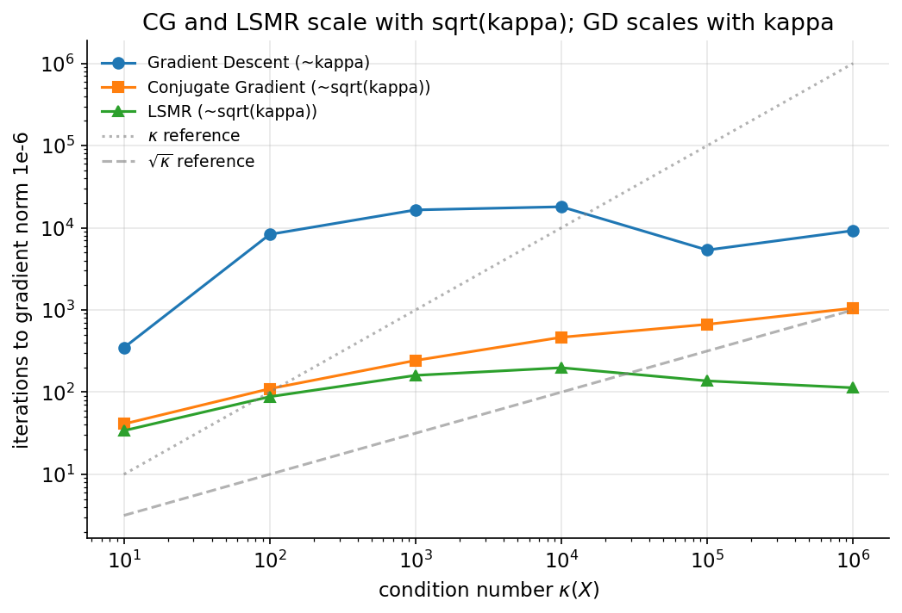

# What Algorithm Should You Actually Use for Least Squares?

*A spectral tour of the landscape — Normal Equation, QR, SVD, Gradient Descent, Conjugate Gradient, LSMR, L-BFGS — and why the textbook GD-vs-NE binary is a pedagogical artifact, not a real choice.*

---

## Who this is for

You've written `np.linalg.solve(X.T @ X, X.T @ y)` for a least-squares problem and shipped it. That recipe is the textbook one and it's also numerically wrong in a way most courses don't tell you about. This post explains why, then walks through what to use instead.

I assume calculus, big-O, and a working idea of what an eigenvalue is. I do not assume familiarity with QR / SVD distinctions, condition numbers, or BLAS — those get explained as we go.

The post starts with **batch gradient descent vs the closed-form solvers** because that's the comparison most people meet first. Sections 8–9 zoom out into the broader algorithm landscape (CG, LSMR, L-BFGS, SGD), where the GD-vs-NE binary stops being the right framing. If you only have time for one thing, read section 1.5 (the unifying principle) and section 7 (the algorithm landscape).

All code, derivations, and figures are reproducible from the [companion repo](../index.md).

---

## 1. The problem and the closed-form solution -- done right

The model: `y = X·θ + ε`. The loss:

```
L(θ) = (1/2n) · ||X·θ − y||²
```

Setting the gradient to zero gives the normal equation `X^T·X·θ = X^T·y`. The naive recipe is to build `X^T·X` and call `solve`. **Don't do this.** Forming `X^T·X` is the single worst thing you can do to a least-squares problem numerically. We'll prove that with measurements in section 4. The reasonable closed-form solvers, in increasing order of stability:

| Recipe | Cost | Stability | Notes |
|---|---|---|---|
| `solve(X^T X, X^T y)` (LU) | `O(np² + p³)` | Worst | Doubles the effective condition number. |
| `cho_solve(X^T X, X^T y)` | `O(np² + p³/3)` | Worst | 2x faster than LU on a symmetric PD matrix. Same κ² penalty. |
| `solve(R, Q^T y)` from QR(X) | `O(np²)` | Good | Operates on `X` directly. The right default for hand-rolled exact solutions. |
| `np.linalg.lstsq` (SVD) | `O(np²)` constant ~5-10× QR | Best | What scikit-learn uses. Handles rank deficiency. |

Why does forming `X^T·X` hurt? Take the SVD `X = U·Σ·V^T`. Then `X^T·X = V·Σ²·V^T`, so

```
κ(X^T·X) = κ(X)²
```

Squaring the condition number means halving your decimal digits of precision before any solver runs. We will see this empirically in section 4 -- the recovery error gap between Cholesky and QR is **seven orders of magnitude** at κ(X) = 10⁸.

Setting up the experiments below, I'll use four named solvers from `src/normal_equation.py`:
- `fit_normal_equation(X, y)` -- the textbook bad recipe (LU on Gram matrix). Kept for pedagogical comparison.
- `fit_cholesky(X, y)` -- the "fast bad recipe" (Cholesky on Gram matrix).
- `fit_qr(X, y)` -- the right hand-rolled exact solver.
- `fit_lstsq(X, y)` -- the right "I'd ship this" exact solver.

**Practical rule of thumb:** QR is the daily driver for hand-rolled exact solutions. SVD (`lstsq`) is the heavy artillery you only deploy when you suspect rank deficiency or perfect collinearity — its constant factor is 5-10× QR's, depending on the LAPACK driver (`gesdd` vs `gesvd`).

And one iterative method:

```
θ ← θ − η · ∇L(θ)
```

with `η ∈ (0, 2/L)`, where `L` is the largest eigenvalue of the Hessian `H = (1/n) X^T·X`. Three regions worth knowing:

- `η < 1/L` — guaranteed monotone convergence on every direction.
- `η = 1/L` — the **optimal** step for the steepest direction (zeroes its error in one step). The standard "safe default."
- `1/L < η < 2/L` — still converges, but oscillates along the steep eigendirections (you trade smoothness for speed; sometimes worth it for poorly-conditioned problems).
- `η ≥ 2/L` — divergence. This is the actual ceiling, not `1/L`.

The bound falls out of the descent lemma for `L`-smooth convex functions, so this is theory, not folklore.

The **optimal** step size for the worst-case convergence rate on a strongly convex quadratic is

```
η* = 2 / (L + μ)
```

where `μ` is the smallest eigenvalue of `H`. This is the step that minimizes the per-iteration error contraction `(κ−1)/(κ+1)` you'd otherwise get with `η = 1/L`. It also makes the connection to scaling vivid: as κ grows, `μ` shrinks, `η*` shrinks toward `2/L`, and convergence collapses. We use `η = 0.9/L` throughout — close enough to optimal in the regimes we care about, and trivial to compute without first solving for `μ`.

---

## 1.5. The unifying principle (the one thing to remember)

Every result in this post reduces to **the singular-value spectrum of `X`**, equivalently the eigenvalues of `H = (1/n) X^T·X` (which are `σᵢ²/n`):

| Phenomenon | Where it lives in the spectrum |
|---|---|
| GD convergence rate | `σ_max / σ_min` — that is, κ |
| GD optimal step size | `2 / (L + μ) = 2n / (σ_max² + σ_min²)` |
| NE / Cholesky accuracy | scales as `1 / σ_min` from data noise, *plus* `1 / σ_min²` from forming `X^T·X` |
| QR / lstsq accuracy | scales as `1 / σ_min` only — no κ² penalty |
| Feature scaling | rescales individual `σᵢ` |
| Standardization | shrinks the `σᵢ` spread (κ down) |
| Whitening | sets all `σᵢ` equal — κ = 1 exactly |
| Ridge regression | replaces `σᵢ²` with `σᵢ² + λ` |
| Early-stopped GD | per-direction shrinkage `[1 − (1 − ησᵢ²/n)^k]` — same shape as ridge |
| Conjugate Gradient | converges in roughly `√κ` steps, not κ |
| When `σ_min → 0` | κ → ∞, NE catastrophic, GD crawls, CG is your best chance |
| SGD | rate driven by `Tr(H)/μ`, not just κ |

If you can answer *"what does this do to the singular values of `X`?"* you can predict everything that follows. The rest of the post is a tour through specific instances of this principle.

---

---

## 2. Sanity check: do they all agree?

```python
X, y, _ = make_regression(n=2000, p=20, noise=0.1, seed=42)
X, _, _ = standardize(X)
theta_ne = fit_normal_equation(X, y)
res = fit_gradient_descent(X, y, lr=safe_lr(X) * 0.9,
                           max_iters=50_000, tol=1e-12)
```

Result on standardized, well-conditioned data:

```
GD iterations:           27 (converged=True)
||theta_GD - theta_NE||: 9.34e-13
```

Both methods land on the same θ to machine precision, and GD only needs 27 iterations to get there. Remember that "tens of iterations" number — section 6 will show that number jumping to 200,000+ from a one-line change to the data.

---

## 3. The geometry, with the gradient direction made explicit

The loss is a convex quadratic. Its level sets are ellipsoids whose axes align with the right singular vectors of `X` (equivalently, the eigenvectors of `H = (1/n) X^T·X`), and whose lengths are proportional to the **inverse singular values of `X`**. Tying this to the SVD `X = U·Σ·V^T` keeps the linear-algebra story consistent with section 4: the Hessian's eigenvalues are exactly `σ_i² / n`, and the condition number κ(H) = κ(X)² — the same κ² penalty we measure later. The condition number κ is the ratio of largest to smallest singular value.

**The geometric fact that explains zig-zagging:** the gradient is always orthogonal to the contour line at any point. In a circular bowl (κ = 1), the orthogonal direction at every point points straight at the minimum. In a long, thin valley (κ ≫ 1), the orthogonal direction at most points lies almost perpendicular to the valley's long axis — across the valley, not down it. So GD takes a step across, overshoots, takes a step back, overshoots, and crawls along the valley one tiny shimmy at a time.

Two figures from `experiments/06_scaling_effect.py`:



Left: feature 2 has 50× the magnitude of feature 1, κ ≈ 2.5×10³ → squashed ellipses. Right: standardized → near-circular contours, κ ≈ 1. **Same data, same loss function, different geometry.**



The mechanism on the left is the orthogonal-to-contour fact: each red dot is a step that lands somewhere far from the minimum because the gradient kept pointing mostly across the valley. On the right the contours are round, so every gradient points roughly at θ\*.

---

## 4. The numerical conditioning experiment — forming X^T X is the thing to avoid

We sweep `κ(X)` from 10¹ to 10⁹, comparing all four exact solvers and early-stopped GD. Two runs: one with realistic noise, one with zero noise to isolate floating-point error.

**With noise = 0.1** (real-world conditions; `experiments/04_conditioning.py`):

```
     kappa          NE        Chol          QR       lstsq          GD (max 20k iters)
     1e+02    1.22e+01    1.22e+01    1.22e+01    1.22e+01    1.09e+01
     1e+04    8.08e+02    8.08e+02    8.08e+02    8.08e+02    8.87e+00
     1e+06    5.88e+04    5.88e+04    5.88e+04    5.88e+04    8.95e+00
     1e+09    2.64e+08         nan    4.01e+07    4.01e+07    8.34e+00
```

When real noise is present, the dominant error source is `noise / σ_min` — i.e., noise amplified by the smallest singular value. All four exact solvers track each other (and grow linearly with κ) until extreme κ. **Early-stopped GD stays bounded around 10**, which I'll explain in section 8 — it's not magic, it's implicit ridge regularization.

**With noise = 0.0** (the floating-point story isolated):

```
     kappa          NE        Chol          QR       lstsq          GD
     1e+04    1.04e-08    7.69e-09    2.97e-13    1.54e-13    2.71e+00
     1e+06    1.93e-05    1.74e-05    4.01e-11    1.74e-11    2.98e+00
     1e+08    3.48e-02    1.75e-01    2.02e-09    9.23e-10    3.32e+00
     1e+09    2.45e+01         nan    1.31e-08    5.15e-09    3.39e+00
```



The two slopes in the log-log plot are the whole story: NE / Cholesky climb at slope **2** (κ²), QR / lstsq at slope **1** (κ). At κ = 10⁸ the lines are eight decades apart.

This is the κ² penalty laid bare. At κ(X) = 10⁸:
- NE / Cholesky (form X^T·X): error ~10⁻¹.
- QR / lstsq (don't form X^T·X): error ~10⁻⁹.
- **Eight orders of magnitude difference, caused entirely by the choice to materialize the Gram matrix.**

**An honest qualifier.** The 8-orders-of-magnitude gap shows up in the *floating-point-only* regime, where `noise = 0`. With realistic noise (the upper table), the dominant error is `noise / σ_min`, which both forming and not-forming `X^T·X` suffer equally. So when do you actually see the κ² penalty bite in real life? When the data is high-precision (noiseless or near-noiseless), or when κ is so extreme that the floating-point error dominates noise (κ > 10⁷ in our setup). For typical noisy regression problems with κ < 10⁶, all four exact solvers give nearly identical answers — but using QR by default costs you nothing and protects you in the cases where it matters.

The standard pointer here is the inequality (Trefethen & Bau, Lecture 18):

```
||δθ̂|| / ||θ̂||  ≲  κ(X) · (||δX|| / ||X||  +  ||δy|| / ||y||)
```

That is the bound you get when you operate on `X` directly via QR or SVD. Form `X^T·X` and you trade `κ(X)` for `κ(X^T·X) = κ(X)²`. The numerical-analysis literature has been telling us this since the 1960s; we keep ignoring it.

The honest framing of section 1's introduction is therefore: when this post talks about "the normal equation failing under poor conditioning," it is failing for *two* compounding reasons — the inherent noise amplification proportional to κ, plus the κ² penalty from forming the Gram matrix. **The first is unavoidable; the second is malpractice.**

(About GD's "error" of ~3.0 in the noiseless case: there is no noise to amplify here. The error is **pure bias from underfitting** — the true `θ*` has large components along the small-singular-value directions, and GD with a bounded iteration budget never moves on those directions. Early stopping isn't preserving accuracy here; it's *causing* the error, by design. We pay this bias to avoid the noise amplification that would occur with more iterations on noisy data. Section 8 makes this trade-off precise.)

---

## 5. Wall time and the textbook-vs-BLAS gap

Standard complexity story: NE is `O(n p² + p³)`, GD is `O(k n p)` per fit, so GD should win for large `p`. In practice, BLAS makes the closed-form solvers shockingly competitive, and the "crossover" sits much further out than the textbook implies.

**Solver-family benchmark** (from `experiments/03_benchmark_p.py`, n = 5000, fixed-iteration GD):

```
    p          NE        Chol          QR            GD (1000 iters)
   10      0.70 ms      0.50 ms      1.40 ms        6.70 ms
  500      8.69 ms      8.44 ms    163.94 ms       52.02 ms
 2000    142.84 ms    133.81 ms    801.83 ms     1601.24 ms
 4000    757.11 ms    683.53 ms   2278.05 ms     9430.84 ms
```



Cholesky beats QR for raw speed (smaller constant), QR beats LU (numerical-style overhead in numpy's reduced QR), GD with a fixed 1000-iteration budget loses to all of them at high p. **The fixed budget is unfair to GD by design** — it shows worst-case behavior when GD is forced to run more iterations than it needs. The convergence-based comparison below is the honest one and is what you should weight when reading conclusions.

**Pushing `p` further** with `n = 15,000` and convergence-based GD (`wallclock_vs_p_crossover.png`):



Cholesky stays ahead of convergence-based GD across the entire tested range up to `p = 12,000`. Both lines have similar log-log slopes, separated by a constant factor of ~5. **There is no dense-data crossover on this hardware in the regime a laptop can hold.** The textbook complexity story is correct as stated — it's just quantitatively imprecise about constants. Cholesky's constant factor (a tuned LAPACK Level-3 routine running near peak FLOPs) is small enough that GD's `O(k·n·p)` doesn't catch up before you run out of memory. On different hardware (GPU, weaker BLAS, more memory bandwidth), the picture shifts.

**Where GD does win is sparse `X`.** With `n = 5000`, `p` from 200 to 4000, density 0.5% (`experiments/08_sparse.py`):

```
    p    NE (dense)     GD (sparse)    speedup
  200       27.41 ms          2.38 ms     11.5x
 1000       43.61 ms         14.75 ms      3.0x
 4000      797.03 ms        366.33 ms      2.2x
```



`scipy.sparse` lets each GD iteration run in `O(nnz)` per step, total `O(k · nnz)` for `k` iterations. NE has to densify `X` to form `X^T·X` regardless of how sparse the input was. The dense-NE column above understates the real cost — at higher density or larger `p`, NE OOMs while sparse GD keeps running. **This is the sentence the textbook should have said:** GD wins when the structure of `X` (sparsity, streaming, distribution) makes mat-vec cheaper than Gram-matrix construction.

**Memory, made literal.** `tracemalloc` on the same solvers (`experiments/07_memory_profile.py`) shows NE's allocation tracking the theoretical `p² · 8` bytes to within fractions of a MB, while GD stays flat at `O(p)`:



At `p = 6000`, NE allocates 274 MB to hold `X^T·X`; GD allocates 0.2 MB. **The memory argument for iterative methods is not a constant-factor footnote — it's a slope difference of `p`.** At `p = 50,000`, NE wants 20 GB for the Gram matrix alone.

---

## 6. The headline: scaling decides everything

Same dataset. Multiply each column by an increasingly different scale factor. Standardize the second copy. Count GD iterations to a gradient norm of `1e-6`:

```
spread=1e+00   unscaled=     16   scaled=  15
spread=1e+01   unscaled=   1402   scaled=  17
spread=1e+02   unscaled= 141788   scaled=  19
spread=1e+05   unscaled= 200000+  scaled=  26
```



**The "tens of iterations" from section 2 is the right column above.** Standardized data with κ ≈ 1 needs 15–26 iterations regardless of how absurdly we abuse the input column scales. The left column is what happens to those exact same iterations on the exact same data if we don't standardize first.

**Why scaling collapses κ — worked through.** Suppose we have well-conditioned `X` with `H = (1/n) X^T·X ≈ I`, so initially `L ≈ 1`, `κ ≈ 1`, and the safe step is `η ≈ 1/L = 1`. Now multiply column `j` by `s = 1000` (call the new design `X'`). What happens?

- **The Hessian.** Multiplying column `j` of `X` by `s` rescales row `j` and column `j` of `X^T·X` by `s` (so the `(j,j)` entry becomes `s² · ||x_j||²`). The new Hessian has one diagonal entry near `s² = 10⁶` while the others stay near `1`.
- **L (largest eigenvalue).** For any symmetric PSD matrix, `λ_max ≥ max_i A_ii` (apply the Rayleigh quotient to the standard basis vector `e_j`: `e_jᵀ H e_j = H_jj ≤ λ_max`). So `L_new ≳ s² = 10⁶`. The smallest eigenvalue stays roughly where it was.
- **κ.** `κ_new = L_new / λ_min ≈ s² · κ_old`. **Scaling one column by 1000 multiplied κ by ~10⁶.**
- **η.** Safe step is `η_new ≤ 2/L_new ≈ 2 · 10⁻⁶`. **Step size has to shrink by `s² = 10⁶`** because the steep direction sets the ceiling.
- **Convergence rate.** GD's per-iteration error contraction is `(κ−1)/(κ+1)`. For `κ_new ≈ 10⁶`, that ratio is essentially `1 − 2/κ ≈ 1 − 2·10⁻⁶`. Iterations to a fixed precision scale as `O(κ · log(1/ε))`. **`s = 1000` → roughly `s² = 10⁶` more iterations.**

That's the whole mechanism. One column multiplied by a constant rescales one diagonal of `H`, which rescales `L`, which forces `η` down by the same factor, which leaves the slow direction (unchanged smallest eigenvalue) needing `s²` times as many tiny steps to traverse the same distance.

The Normal Equation has the *opposite* property *in theory* — it is scale-invariant under invertible diagonal rescaling. In *practice*, the same κ growth that hurts GD also hurts `solve`'s numerical accuracy, which is why even when you use NE you should standardize.

**Caveat: this clean `s²` story assumes the scaled column is roughly orthogonal to the others.** If features are correlated, scaling column `j` perturbs the entire covariance structure — the off-diagonal block of `X^T·X` involving column `j` also rescales by `s`, and `λ_min` can shift. The `κ_new ≈ s² · κ_old` relationship is an upper-bound-flavored heuristic in that case, not an equality. The qualitative conclusion (κ blows up, GD dies) still holds, but the exact `s²` factor is the orthogonal-features special case.

Standardization isn't whitening — that would also rotate to decorrelate features, achieving κ = 1 exactly. But standardization gets you 80% of the way there for free, and that's enough to turn 200,000 iterations into 26.

Five orders of magnitude in iteration count, controlled by a one-line transformation on the data.

---

## 7. The actual algorithm landscape — and why GD vs NE is a false dichotomy

Up to here this post has compared GD against the closed-form solvers because that's the comparison textbooks set up. **The honest take is that for most "interesting" least-squares problems neither GD nor naive NE is what you should reach for.** The real candidate set is roughly seven algorithms. Here they are, with where each lives in the spectral story:

| Algorithm | Iterations to ε accuracy (informal) | Memory | When it wins |
|---|---|---|---|
| **NE / Cholesky** (LU on `X^T·X`) | direct | `O(p²)` | small dense `p`, well-conditioned, you trust your data |
| **QR on X** | direct | `O(np)` for the factorization | small-to-medium dense `p`, when you want exact and stable |
| **lstsq (SVD)** | direct | `O(np)` larger constant | suspected rank deficiency or collinearity |
| **Gradient Descent** | `O(κ · log(1/ε))` | `O(p)` | rarely the right answer in production — pedagogically central |
| **Conjugate Gradient (CGNR / CGLS)** | `O(√κ · log(1/ε))` | `O(p)` | this is what GD *should* be replaced with for any iterative least-squares solve |
| **LSMR / LSQR** | `O(√κ)` flavor | `O(np)` for the operator | **the production answer for sparse least squares** |
| **L-BFGS** | empirically near-CG, no κ-dependent guarantee for non-quadratic | `O(m·p)` for `m`-history (typically `m=10`) | dense or sparse, smooth, `p` in the thousands; killer when you can't afford full Hessians |

A few things worth pulling out of that table:

- **Conjugate Gradient is the answer to "GD is slow when κ is bad."** It converges in `√κ` iterations instead of `κ`. From `experiments/09_cg_lsmr.py` (n=1000, p=50, gradient-norm tolerance 1e-6):

  ```
     kappa     sqrt(kappa)     GD iters     CG iters    LSMR iters
     1e+02         10           8,308          110           88
     1e+04        100          18,007          465          198
     1e+06      1,000           9,227*       1,050          113
  ```

  

  CG's iteration count tracks the `√κ` reference line essentially exactly. (GD's 9k at κ=1e6 looks misleadingly small because GD stops early on a noise floor — see section 8 for what's really happening.) CG is to GD what Cholesky is to inverting matrices by hand: not optional. If you find yourself reaching for batch GD on a least-squares problem, you should almost always reach for CG instead.
- **LSMR / LSQR are the production-grade iterative least-squares solvers.** They are LSQR-family Krylov methods designed for sparse `X`. SciPy ships them as `scipy.sparse.linalg.lsmr` and `lsqr`. Our sparse benchmark in section 5 understated GD's competition — LSMR would beat both dense NE *and* sparse GD by another factor.
- **L-BFGS** is the right answer for many "p in the thousands, dense, smooth, no closed form" problems — it builds a low-memory approximation to the inverse Hessian and uses it to take quasi-Newton steps. For least squares specifically, CG or LSMR usually wins; for general smooth losses, L-BFGS is often the default.
- **Preconditioning is the meta-idea.** All iterative methods (GD, CG, LSMR, L-BFGS) get faster when you transform the problem into one with smaller κ. **Standardization is a cheap diagonal preconditioner.** Whitening is the Platonic-ideal preconditioner. Real preconditioners (incomplete Cholesky, Jacobi, multigrid) are a deep field; for ML-sized problems, standardization usually does the work.

The corrected decision flowchart:

```
Production code, dense X, p < ~10k → sklearn.linear_model.LinearRegression (uses lstsq).

Want a hand-rolled exact solver?
  Well-conditioned dense → QR on X.
  Suspect rank deficiency / collinearity → SVD-based lstsq with explicit rcond.
  Don't form X^T X by default. Don't use solve() on the Gram matrix.

Need an iterative method (memory-bound, sparse, streaming, or kappa is ugly)?
  Dense or sparse, ill-conditioned → Conjugate Gradient (CGNR / CGLS).
                                     ~sqrt(kappa) iterations vs GD's kappa.
  Sparse, large p, exact-flavor      → LSMR / LSQR (scipy.sparse.linalg).
  Smooth non-quadratic loss          → L-BFGS.
  ML-style training, n huge          → SGD or mini-batch with a schedule.
  L1 / elastic-net                   → coordinate descent or proximal GD.

Always: standardize. It's the cheap diagonal preconditioner that makes every
iterative method finish in a reasonable number of steps.
```

The takeaway: **batch gradient descent is rarely the right tool for an actual least-squares problem.** It's pedagogically central because it's the cleanest place to see scaling, conditioning, and implicit regularization at work — but in production code its niche is small. If you understand why GD is slow under bad κ, you understand why CG was invented; if you understand the κ² penalty, you understand why LSMR uses Givens rotations on `X` directly. Sections 1–6 are the foundation; this section is the deployment story.

---

## 8. The deepest idea in the post: early-stopped GD ≈ ridge regression

Before the math: **gradient descent doesn't fix ill-conditioning. It just avoids fully solving it.** Early-stopped GD is not an approximate exact solver; it is a *different estimator* with built-in bias. The numbers in section 4 that look like GD "handling" bad κ are GD refusing to even try the ill-conditioned directions. That refusal is sometimes what you want and sometimes a footgun. Here's the math.

Take the SVD `X = U·Σ·V^T`. Project everything into the singular basis. Each singular direction `i` evolves independently under GD with rate proportional to `σ_i²/n`. After `k` iterations of GD with step size `η`, the contribution of direction `i` to `θ_k` is approximately:

```
component_i(θ_k) ≈ component_i(θ*) · [1 − (1 − η σ_i² / n)^k]
```

For large `σ_i`, the bracket is essentially 1 — GD has fit that direction. For small `σ_i`, the bracket is close to 0 — GD has barely moved on that direction. **The shrinkage factor depends on `σ_i`**, exactly the shape of the ridge regression filter:

```
component_i(θ_ridge) = component_i(θ*) · [σ_i² / (σ_i² + λ)]
```

Both downweight small-`σ_i` directions (the ones that amplify noise). **Early stopping ≈ ridge regression with an effective regularization parameter set by `1/(η · k)`.** Yao, Rosasco & Caponnetto (2007) make this rigorous; Wilson et al. (2017) trace the same idea through modern adaptive optimizers.

**Where the analogy breaks.** Three places, ranked by how much they will hurt you in practice:

1. **Initialization dependence.** Ridge regression's solution depends only on `λ`, full stop. Early stopping's effective regularization depends on `(η, k, init)` — *different random seeds give different solutions*. If you treat early stopping as a drop-in regularizer in a cross-validated pipeline without controlling init, your results are non-reproducible. This catches people.
2. **Path dependence.** Ridge has a clean convex regularization path in `λ`. Early stopping's "path" is whatever trajectory GD happened to take, which depends on the geometry, the step size, and where you started. There is no equivalent of a "regularization path" plot.
3. **Non-quadratic loss.** Once `L` isn't a quadratic, the per-singular-direction shrinkage formula above is gone. The ridge analogy becomes a heuristic, not a theorem. Yao, Rosasco & Caponnetto (2007) make this rigorous in the kernel-regression case; deeper extensions are research-grade.

**Why this matters far beyond linear regression.** This entire post is, secretly, about why optimization choices matter for generalization. Deep networks have many orders of magnitude more parameters than training examples, yet generalize. A piece of the answer is that SGD's implicit regularization (with the same per-direction-shrinkage flavor as the formula above, plus noise) systematically prefers some solutions over others — typically flatter minima, smaller-norm interpolators. The linear regression demo is the simplest setting where you can write down the exact mechanism, and it's the right mental model to carry into the deep-learning case.

---

## 9. The SGD distinction (so the comparison is honest)

This entire post compared **batch** GD — every iteration looks at all `n` samples — against closed-form solvers. Modern ML uses **stochastic / mini-batch** GD: each update sees a small sample, which is what makes training on `n = 10⁸` tractable. The differences that matter for the spectral story this post is built around:

- **Convergence-rate driver changes.** Batch GD on a strongly convex quadratic converges at a rate set by κ = `L / μ`. For least-squares SGD with iterate averaging (Bach & Moulines 2013), the rate is bounded by something *trace-like* — roughly `Tr(H) / μ` — instead of `L / μ`. The qualitative message is what matters: SGD's rate is set by an **aggregating** spectral quantity, not by the worst-direction ratio. A problem dominated by one giant eigenvalue paralyzes batch GD because κ explodes; SGD survives because the aggregate doesn't blow up the same way. (For general SGD with non-quadratic loss the canonical rates are different again — `O(1/√k)` for non-strongly-convex, `O(1/k)` for strongly convex with the right schedule. Don't carry one specific bound across regimes.)
- **Implicit regularization is stronger.** SGD's mini-batch noise adds an extra regularizer beyond early stopping — it preferentially finds flat minima of the loss landscape, which is part of why over-parameterized models generalize.
- **Step-size analysis changes.** The `η < 2/L` ceiling from section 1 doesn't carry over to SGD directly; you need a learning-rate schedule (the standard `O(1/k)` decay, or a warmup + cosine schedule in modern practice).
- **Asymptotic rates.** Batch GD is *geometric* in κ on a strongly convex function. SGD is `O(1/k)` even with the optimal schedule — slower per-iteration progress, but each iteration is `n/batch_size` times cheaper.
- **Batch-size tradeoff.** Small batches → more noise → more implicit regularization but slower per-iteration progress. Large batches → less noise → faster optimization but worse generalization (Keskar et al. 2016 makes this empirical).

The intuition built here — scaling is decisive, conditioning kills closed forms, early stopping is implicit regularization, the spectrum is the unifying object — *does* transfer to SGD. The specific bounds and benchmarks don't.

---

## 10. Failure modes, side by side

| Failure | NE / Cholesky | QR / lstsq | GD |
|---|---|---|---|
| `κ(X) = 10⁶`, no noise | recovery error ~1e-5 | ~1e-11 | early-stop bounded |
| `κ(X) = 10⁶`, noise 0.1 | ~6e4 | ~6e4 | early-stop ~10 (implicit ridge) |
| Two collinear columns | LU may return garbage; Cholesky raises | min-norm solution via SVD | min-norm solution |
| `p = 50,000` dense | `X^T·X` is 20 GB → OOM | OOM (factorizing X is also large) | runs on a laptop |
| Sparse `X`, density 0.5% | NE densifies → wastes RAM | densifies the factorization | `O(nnz)` per iteration; orders-of-magnitude faster |
| Wildly mixed feature scales | scale-invariant in theory; degraded in practice via κ growth | same | one bad column → 10⁴× more iterations |
| `η > 1/L` | n/a | n/a | divergence |
| Streaming data | rebuild from scratch | rebuild from scratch | natural fit (SGD) |

Each row is a real script in `experiments/`.

---

## 11. Take-aways

0. **The unifying principle.** Every result here lives in the singular-value spectrum of `X`. Scaling rescales individual `σᵢ`; standardization compresses them; ridge replaces `σᵢ²` with `σᵢ²+λ`; early stopping down-weights small-`σᵢ` directions; NE explodes when `σ_min` shrinks; CG converges in `√κ` instead of `κ`; SGD's rate is governed by an aggregate spectral quantity, not the worst-direction ratio. Ask *"what does this do to the singular values?"* and rederive whatever you need.
1. **All exact methods give the same answer when they all work.** Sanity-check this once and then stop being surprised.
2. **Don't form `X^T·X`** unless you've already verified κ(X) is small and noise is moderate. Use QR (default) or SVD (when rank deficiency is suspected). The κ² penalty is real but only dominates noise when κ is extreme.
3. **The textbook GD vs NE binary is a false dichotomy.** The actual landscape includes CG, LSMR, L-BFGS, and proximal methods. Batch GD is rarely the right production tool for least squares.
4. **For ill-conditioned iterative least squares, use Conjugate Gradient.** `√κ` instead of `κ` iterations. Measured here: 1050 vs ~9000 at κ=10⁶.
5. **For sparse least squares, use LSMR.** SciPy ships it. It beats both dense NE and sparse GD.
6. **Memory is the real argument for iterative methods on dense problems.** NE allocates `p²·8` bytes, exactly. CG / LSMR / L-BFGS / GD allocate `O(p)` to `O(m·p)`.
7. **Scaling is decisive for every iterative method.** 16 → 200,000+ iterations from a one-line transformation. Standardization is a cheap diagonal preconditioner. Always use it.
8. **Early-stopped GD doesn't fix ill-conditioning — it avoids solving it.** Different estimator (implicit ridge, `λ_eff ≈ 1/(η·k)`), not an approximate exact solver. Path- and init-dependent. Don't treat it as a drop-in for ridge in a reproducible pipeline without controlling the seed.
9. **Batch GD is not SGD.** Batch GD's convergence is governed by κ; SGD's is governed by an aggregate spectral quantity (trace-like for least-squares SGD). Different bound, different intuitions, same spectrum-driven story.

---

## References

- Trefethen & Bau, *Numerical Linear Algebra*, Lectures 11, 18, 19. The right citation for the κ² penalty and the case for QR / SVD.
- Boyd & Vandenberghe, *Convex Optimization*, Ch. 9. Gradient descent convergence rates and the role of κ.
- Hastie, Tibshirani, Friedman, *Elements of Statistical Learning*, Ch. 3. Linear regression at the level this post assumes.
- Yao, Rosasco, Caponnetto (2007), *On Early Stopping in Gradient Descent Learning*. Formalizes section 8.
- Wilson, Roelofs, Stern, Srebro, Recht (2017), *The Marginal Value of Adaptive Gradient Methods in Machine Learning*. Bridge from this post to modern optimizers.
- Keskar, Mudigere, Nocedal, Smelyanskiy, Tang (2016), *On Large-Batch Training for Deep Learning*. The batch-size / sharp-vs-flat-minima tradeoff cited in section 9.
- Bach & Moulines (2013), *Non-strongly-convex smooth stochastic approximation with convergence rate O(1/n)*. The right pointer for the trace-flavored SGD rate cited in section 9.
- Saad, *Iterative Methods for Sparse Linear Systems*. The standard reference for CG, LSMR, preconditioning.
- Paige & Saunders (1982), *LSQR: An Algorithm for Sparse Linear Equations and Sparse Least Squares*. The original LSQR paper.
- Fong & Saunders (2011), *LSMR: An Iterative Algorithm for Sparse Least-Squares Problems*. The LSMR algorithm SciPy implements.
- Nocedal & Wright, *Numerical Optimization*, ch. 7. L-BFGS chapter.
- scikit-learn `LinearRegression` source. Short, worth reading; it's `lstsq` plus bookkeeping.

---

*Code, derivations, and reproducibility in the [companion overview](../index.md). Open an issue if any benchmark doesn't replicate on your hardware — the wall-clock numbers in section 5 are CPU + BLAS dependent and I want to know if the crossover lives somewhere different on your machine.*
